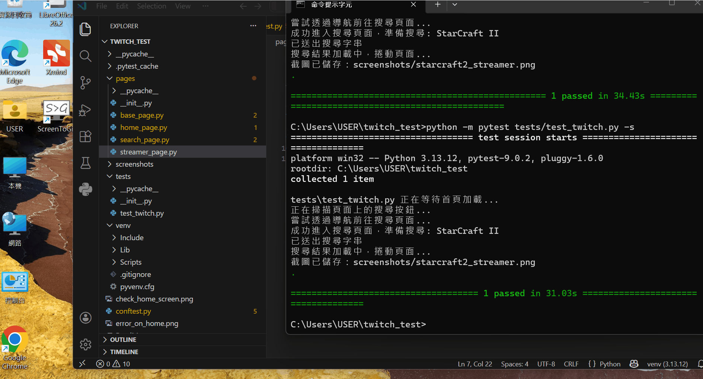

# Twitch WAP Automation Framework (Python + Selenium)

This is a professional automation testing project designed to verify the user flow on the Twitch Mobile (WAP) website. The framework is built using **Python**, **Selenium**, and **Pytest**, following the **Page Object Model (POM)** design pattern for maximum scalability and maintainability.

## 📺 Demo


---

## 🚀 Scenarios Covered
1. **Navigate** to Twitch Mobile (`m.twitch.tv`).
2. **Handle** initial pop-ups or navigation to the Search page.
3. **Search** for the game "**StarCraft II**".
4. **Scroll down** twice to simulate user browsing.
5. **Select** a live streamer from the results.
6. **Verify** the streamer's page loads and **Capture a screenshot** as evidence.

---

## 🏗️ Framework Design & Folder Structure
This project follows the **Page Object Model (POM)** to ensure that UI changes only require updates in one place, keeping tests clean and readable.

- `pages/`: Contains Page Objects. Each file represents a web page and its locators/actions.
  - `base_page.py`: Common wrappers for Selenium (Explicit Wait, Clicks, Scrolling).
  - `home_page.py`, `search_page.py`, `streamer_page.py`: Page-specific logic.
- `tests/`: Contains the actual test cases using Pytest.
- `conftest.py`: Global configuration for the Pytest runner and Chrome Mobile Emulation setup.
- `screenshots/`: Automatically stores screenshots captured during the test.
- `requirements.txt`: List of Python dependencies.

---

## 🛠️ Setup and Execution

### Prerequisites
- Python 3.10+
- Google Chrome Browser

### Installation
1. Clone the repository:
   ```bash
   git clone <your-repository-link>
   cd twitch_test

2.Install dependencies:
pip install -r requirements.txt

3.Running the Test
Execute the following command in your terminal:
python -m pytest tests/test_twitch.py -s


4.Technical Details
Mobile Emulation: Configured via ChromeOptions to simulate an iPhone X device environment.

Wait Strategy: Utilizes WebDriverWait (Explicit Waits) to handle asynchronous content loading and ensure test stability.

Robust Navigation: Implements direct URL navigation and JavaScript execution to bypass unstable UI overlays.

Evidence Collection: Includes automated screenshot capture upon reaching the final test step.